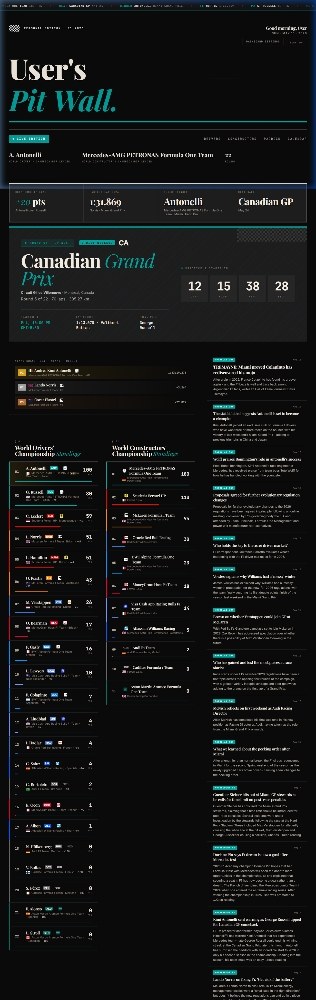
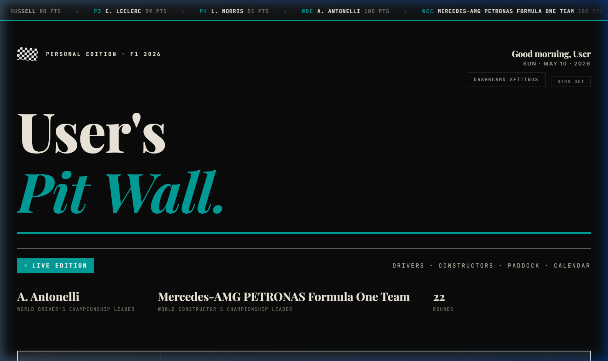
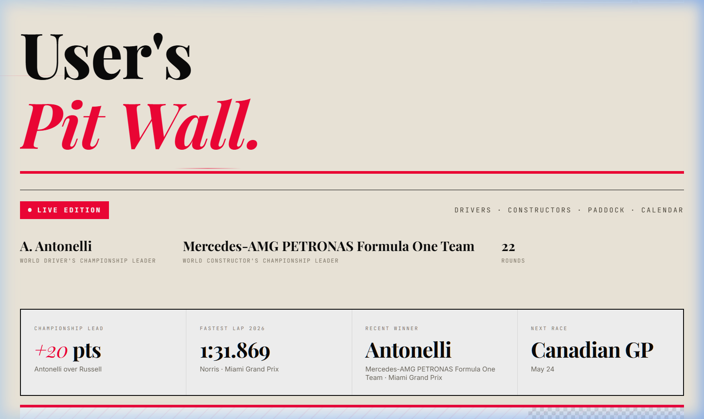
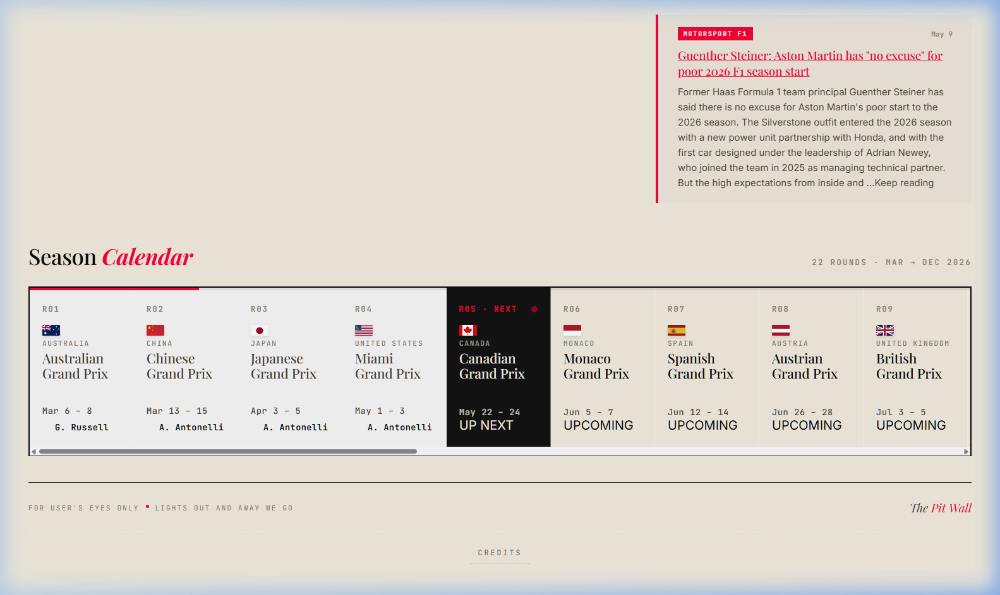
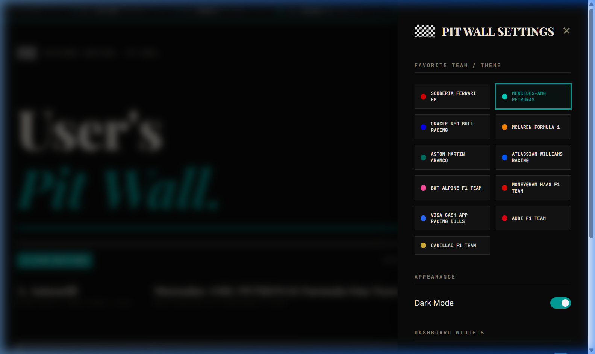

# 🏁 F1 Pit Wall Dashboard · 2026 Edition

> A high-performance, immersive racing dashboard designed for the future of Formula 1.

  

## 🏎️ Overview

The **F1 Pit Wall Dashboard** is a premium web application built for the 2026 season concept. It provides enthusiasts with a real-time command center experience, blending cutting-edge aesthetics with deep data integration. Whether you're tracking the championship lead or checking the next session's countdown, the Pit Wall puts you in the engineer's seat.

## ✨ Key Features

### 📡 Live Telemetry & Ticker
Stay updated with a dynamic top ticker providing the latest WDC/WCC standings, race winners, and fastest laps as they happen.

### 🌓 Dual-Mode Aesthetics
Experience the dashboard in sleek **Dark Mode** or high-contrast **Light Mode**, with a full theme engine that adapts to your favorite F1 team's identity.

<table align="center">
  <tr>
    <td align="center"><b>Dark Mode</b></td>
    <td align="center"><b>Light Mode</b></td>
  </tr>
  <tr>
    <td></td>
    <td></td>
  </tr>
</table>

### 📅 Smart Calendar & Sessions
Never miss a session. The dashboard automatically calculates local times and countdowns for every FP1, Qualifying, Sprint, and Race day, shifting focus as the weekend progresses.

  

### 🛠️ Personalization Command Center
Tailor your experience. Choose your favorite team, toggle dashboard widgets (News, Standings, Podium), and persist your preferences across sessions.

  

## 🛠️ Tech Stack

- **Framework**: React 19 + Vite
- **State Management**: Zustand
- **Styling**: Vanilla CSS (Semantic Variable System)
- **Backend/Auth**: Firebase (Firestore & Authentication)
- **Data Sources**: Ergast API (Jolpi Mirror), OpenF1 API, RSS News Feeds

---

> [!TIP]
> Use the **Dashboard Settings** to toggle the News Feed if you want a more focused data view.

> [!IMPORTANT]
> The 2026 data is a concept simulation. Winner data for past rounds is pulled dynamically from the concept API.

---

*Designed for the Paddock · 2026 Personal Edition*
